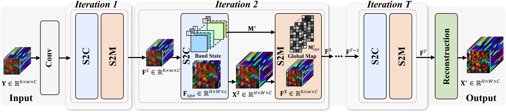
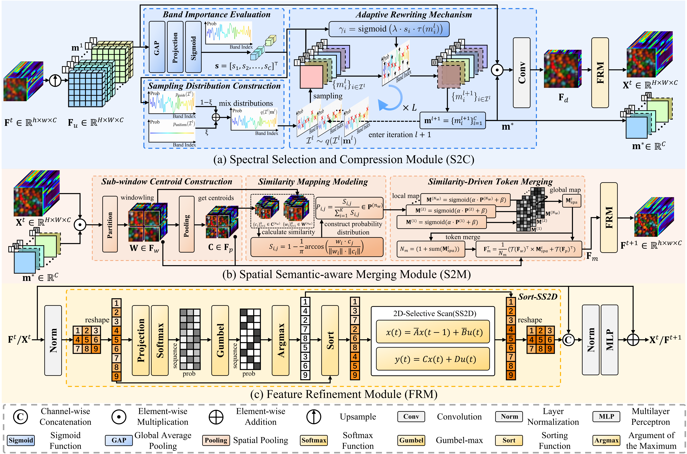

<div align="center">

# [TGRS 2026] Spectrally-Spatially Coupled Dynamic Reduction for Efficient Hyperspectral Image Super-Resolution

Lingyu Zheng, [Jingyuan Xia](https://www.xiajingyuan.com/), [Zhixiong Yang](https://zhixiongyang21.github.io/), Chen Wu, Shengxi Li, Xin Deng, Mai Xu

<p>
  
  
  
  
</p>

<p>
  <a href="#-overview"></a>
  <a href="#️-environment-setup"></a>
  <a href="#️-quick-start"></a>
  <a href="#-citation"></a>
</p>

[](https://github.com/XYLGroup/S2CD-Net)

</div>

---

# Table of Contents

| Section | Description |
|---|---|
| 📌 [Overview](#-overview) | Paper abstract and method summary |
| ⚙️ [Environment Setup](#️-environment-setup) | Dependencies and installation |
| 🗂️ [Project Structure](#️-project-structure) | Repository layout |
| 📁 [Datasets Preparation](#-datasets-preparation) | Expected `.mat` dataset format |
| ▶️ [Quick Start](#️-quick-start) | Training, testing, and evaluation commands |
| 🧩 [Configuration](#-configuration) | Command-line options and path notes |
| 📚 [Citation](#-citation) | How to cite this work |

# 📌 Overview

> **Abstract:** *Hyperspectral image super-resolution faces a fundamental challenge in practical applications: achieving high-fidelity reconstruction on resource-constrained edge devices while maintaining manageable computational complexity. Although recent deep learning-based single-image methods have shown remarkable success, their substantial computational overhead hinders deployment. Meanwhile, emerging architectures like Mamba offer efficient long-range modeling potential but struggle with the inherently high dimensionality of hyperspectral data, leading to prohibitively long sequences and excessive computational loads. Existing lightweight strategies often process spectral and spatial dimensions independently, failing to exploit their intrinsic coupled correlation and resulting in a suboptimal performance-efficiency trade-off. To address this, this paper proposes a Spectrally-Spatially Coupled Dynamic Lightweight Network. Its core innovation is a novel paradigm of coupled reduction and independent learning. We first design a dual-stage collaborative dimensionality reduction mechanism, where spectral selection and spatial compression mutually guide and refine each other in a closed loop, enabling intelligent and precise removal of cross-dimensional redundancy. Subsequently, the resulting low-redundancy spectral and spatial sequences are fed into dedicated, lightweight SS2D scanners for independent and in-depth global modeling, ensuring rich feature representation while reducing complexity. Experiments demonstrate that our method requires only minimal parameters and computational cost, yet achieves reconstruction quality comparable to and even surpassing current non-lightweight state-of-the-art methods, establishing a new optimal balance between performance and efficiency.*

S2CD-Net is designed for **single-image hyperspectral image super-resolution**. Given a low-resolution hyperspectral image cube, the model reconstructs a high-resolution cube while preserving both spatial details and spectral fidelity.

<div align=center>

</div>

<div align=center>

</div>


# ⚙️ Environment Setup

Recommended software stack:

- Python 3.8+
- CUDA-enabled GPU
- PyTorch with a CUDA version matching your system

Create an environment:

```bash
conda create -n s2cd python=3.8 -y
conda activate s2cd
```

Install dependencies:

```bash
pip install -r requirements.txt
```


# 🗂️ Project Structure

```text
S2CD-Net/
├─ checkpoint/              # saved model checkpoints
├─ datasets/                # prepared HSI-SR datasets in .mat format
├─ result/                  # test outputs and reconstructed .mat files
├─ runs/                    # TensorBoard logs
├─ data_utils.py            # dataset loading utilities
├─ eval.py                  # PSNR, SSIM, SAM, ERGAS, RMSE, CC metrics
├─ model.py                 # S2CD-Net network definition
├─ option.py                # command-line arguments
├─ test.py                  # testing and evaluation script
└─ train.py                 # training and validation script
```

# 📁 Datasets Preparation

## Expected Directory Layout

The training and testing scripts expect datasets to be organized by dataset name and scale factor:

```text
S2CD-Net/
└─ datasets/
   └─ CAVE/
      └─ mcodes/
         └─ dataset/
            └─ CAVE_x4/
               ├─ train/
               │  ├─ 001.mat
               │  ├─ 002.mat
               │  └─ ...
               └─ test/
                  ├─ 001.mat
                  ├─ 002.mat
                  └─ ...
```

For other datasets, replace `CAVE` and `x4` accordingly, for example:

```text
datasets/Chikusei/mcodes/dataset/Chikusei_x4/
datasets/Pavia/mcodes/dataset/Pavia_x2/
```

## `.mat` File Format

Each training and validation `.mat` file should contain:

| Key | Shape | Description |
|---|---|---|
| `lq` | `H x W x C` | Low-resolution hyperspectral input |
| `gt` | `sH x sW x C` | High-resolution ground truth |

For `test.py`, the file also reads `bic`:

| Key | Shape | Description |
|---|---|---|
| `bic` | `sH x sW x C` | Bicubic-upsampled reference input, kept for compatibility |

Please make sure all data are normalized to `[0, 1]` before training/testing.

> **Note:** For comprehensive details on MATLAB dataset generation, preprocessing scripts (like `crop_image.m`), and configuration of different scale factors, please refer to [`datasets/README.md`](datasets/README.md).

# ▶️ Quick Start

## 1. Train

Example: train S2CD-Net on CAVE with `x4` super-resolution and 31 spectral channels.

```bash
python train.py \
  --cuda \
  --gpus 0 \
  --datasetName CAVE \
  --upscale_factor 4 \
  --inch 31 \
  --batchSize 4 \
  --nEpochs 200
```

Checkpoints are saved every 10 epochs under:

```text
checkpoint/S2CD_Net_CAVE_4_epoch_*.pth
```

TensorBoard logs are saved under `runs/`:

```bash
tensorboard --logdir runs
```

## 2. Resume Training

```bash
python train.py \
  --cuda \
  --gpus 0 \
  --datasetName CAVE \
  --upscale_factor 4 \
  --inch 31 \
  --resume checkpoint/S2CD_Net_CAVE_4_epoch_100.pth
```

## 3. Test / Evaluate

```bash
python test.py \
  --cuda \
  --gpus 0 \
  --datasetName CAVE \
  --upscale_factor 4 \
  --inch 31 \
  --model_name checkpoint/S2CD_Net_CAVE_4_epoch_200.pth
```

The script reports the average:

```text
PSNR / SSIM / SAM / ERGAS / RMSE / CC
```

It also reports runtime statistics:

```text
FPS, AvgTime(s), MaxMem(MB)
```

Reconstructed results are saved as `.mat` files under:

```text
result/CAVE/4/S2CD_Net/
```

Each saved result contains:

```text
gt   # ground truth HSI
img  # reconstructed SR HSI
```

## 4. Model Complexity Test

`model.py` includes a simple profiling entry for FLOPs, parameters, and FPS.

```bash
python model.py
```

Before running, adjust the hard-coded testing values in `model.py` if needed:

```python
upscale = 4
inch_dim = 128
dddim = 256
```

# 🧩 Configuration

Main command-line options are defined in `option.py`:

| Argument | Default | Description |
|---|---:|---|
| `--upscale_factor` | `4` | Super-resolution scale factor |
| `--seed` | `4` | Random seed |
| `--batchSize` | `4` | Training batch size |
| `--nEpochs` | `200` | Number of training epochs |
| `--cuda` | `False` | Use CUDA |
| `--gpus` | `0` | GPU ids |
| `--threads` | `8` | Number of DataLoader workers |
| `--resume` | `""` | Path to checkpoint for resuming training |
| `--start-epoch` | `1` | Manual start epoch |
| `--datasetName` | `CAVE` | Dataset name |
| `--modelName` | `S2CD_Net` | Model name used for logs/checkpoints |
| `--inch` | `31` | Number of spectral channels |
| `--model_name` | `""` | Checkpoint path used by `test.py` |


# 🔧 Path Configuration

The uploaded `train.py` and `test.py` contain absolute dataset/output paths. Before running on your own machine, either make your folders match those paths or replace them with relative paths.

Recommended relative-path version:

```python
repo_root = os.path.dirname(os.path.abspath(__file__))
data_root = os.path.join(
    repo_root,
    "datasets",
    opt.datasetName,
    "mcodes",
    "dataset",
    f"{opt.datasetName}_x{opt.upscale_factor}",
)
```

For `train.py`:

```python
train_set = TrainsetFromFolder(os.path.join(data_root, "train"))
val_set = ValsetFromFolder(os.path.join(data_root, "test"))
```

For `test.py`:

```python
input_path = os.path.join(data_root, "test")
out_path = os.path.join(
    repo_root,
    "result",
    opt.datasetName,
    str(opt.upscale_factor),
    opt.modelName,
)
os.makedirs(out_path, exist_ok=True)
```

# 🧠 Method Details

Default model settings used by the scripts:

```python
S2CD_Net(
    inch=opt.inch,
    dim=256,
    upscale=opt.upscale_factor,
    d_state=16,
    inner_rank=64,
    num_tokens=128,
    mlp_ratio=2.0,
    n_sample=64,
    lamuda=1.11,
)
```

# ✅ Evaluation Metrics

The evaluation script computes common HSI-SR metrics:

| Metric | Meaning |
|---|---|
| PSNR | Peak Signal-to-Noise Ratio |
| SSIM | Structural Similarity |
| SAM | Spectral Angle Mapper |
| ERGAS | Relative Global Dimensional Synthesis Error |
| RMSE | Root Mean Square Error |
| CC | Cross Correlation |

# 📌 Tips

- Set `--inch` to the spectral channel number of your dataset.
- Keep `.mat` keys consistent with `data_utils.py` and `test.py`: `lq`, `gt`, and optionally `bic`.
- For CAVE, `--inch 31` is commonly used.
- For Chikusei or Pavia, update `--inch` according to the processed spectral bands.
- If `mamba-ssm` fails to install, first check that your PyTorch/CUDA versions are compatible with your compiler and GPU driver.
- When testing without a GPU, remove `--cuda`, but note that Mamba/SS2D inference is expected to be much slower on CPU.

# 📚 Citation

If this repository is useful for your research, please cite:

```bibtex
@article{zheng2026s2cdnet,
  author={Zheng, Lingyu and Xia, Jingyuan and Yang, Zhixiong and Wu, Chen and Li, Shengxi and Deng, Xin and Xu, Mai},
  journal={IEEE Transactions on Geoscience and Remote Sensing}, 
  title={Spectrally-Spatially Coupled Dynamic Reduction for Efficient Hyperspectral Image Super-Resolution}, 
  year={2026},
  volume={},
  number={},
  pages={1-1},
  doi={10.1109/TGRS.2026.3688486}}
```

# 🙏 Acknowledgements

This code is based on [`MambaIRv2`](https://github.com/csguoh/MambaIR) ,[`Context-Cluster`](https://github.com/ma-xu/Context-Cluster) and [`SSPSR`](https://github.com/junjun-jiang/SSPSR). We gratefully thank the authors for their wonderful works.

# 📄 License

The majority of S2CD-Net is licensed under an [Apache License 2.0](https://github.com/XYLGroup/S2CD-Net/LICENSE)
